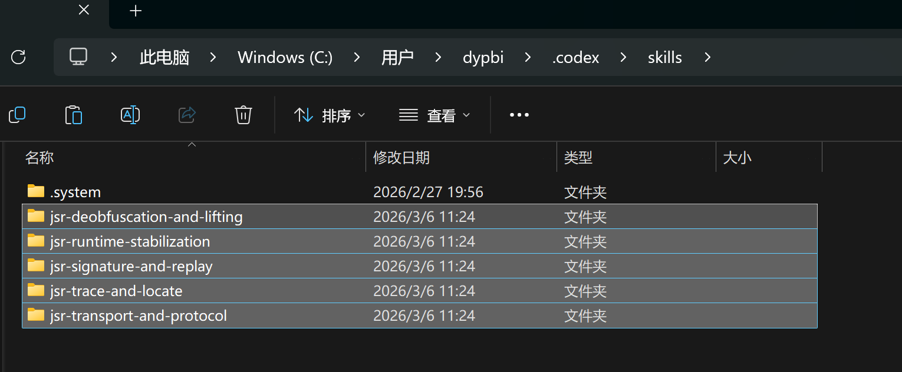

# reverse-skill

面向 Web JS 分析、调试与兼容性诊断的 AI skills 仓库。

这些 skills 主要用于帮助模型在授权场景下梳理动态参数形成路径、识别运行时依赖、理解打包与协议边界，并输出结构化分析结论、依赖清单和受控复现说明。

## 安装方式

### 1. 安装 JSReverser-MCP

[JSReverser-MCP](https://github.com/NoOne-hub/JSReverser-MCP)

### 2. 安装 jsr skills

将以下目录完整复制到客户端的 skills 根目录

- `jsr-trace-and-locate`
- `jsr-runtime-stabilization`
- `jsr-deobfuscation-and-lifting`
- `jsr-signature-and-replay`
- `jsr-transport-and-protocol`
- `jsr-shared-references`

客户端目录：

| 客户端 | 安装位置 |
|---|---|
| `Codex` | `%USERPROFILE%\.codex\skills\` |
| `Claude Code` | `%USERPROFILE%\.claude\skills\` |



## 使用边界

这些 skills 默认面向以下用途：

- 已授权场景下的页面行为分析与调试
- 动态参数形成路径与状态依赖识别
- 浏览器与本地执行差异诊断
- 打包、混淆、`worker`、`wasm` 与协议层结构理解

默认不以恢复第三方受保护接口可调用性为目标，也不默认要求输出可直接用于生产调用的脚本、凭据提取流程或自动化调用闭环。

## 推荐使用方式
将这段话发给 AI：

```text
使用：jsreverse mcp
探索：<目标页面入口 / 当前上下文 / 是否已有授权环境>
分析：<目标动态字段、调用路径、已知症状、希望确认的机制>
方式：优先梳理参数形成路径、运行时依赖与状态边界，必要时提供最小复现和受控验证说明
交付：输出结构化分析结论、依赖清单、伪代码或研究用最小复现样例
审查：明确哪些结论来自本地计算、哪些依赖前置状态，并记录验证结果摘要
```

如果你已经知道问题归属，再显式点名 skill。

```text
$jsr-trace-and-locate 这个页面里有动态请求字段，请按写入边界梳理参数形成路径，确认 entry、builder、writer 三层，并给出最小复现证据。
```

更细的操作方式、显式 skill 模式、组合模式与证据标准见 [docs/usage.md](docs/usage.md)。

## 当前 Skills

| Skill | 用途 | 典型产出 |
|---|---|---|
| `jsr-trace-and-locate` | 梳理动态参数的形成路径、写入边界与关键依赖来源 | `entry -> builder -> writer` 调用链、关键函数签名、最小复现证据 |
| `jsr-runtime-stabilization` | 处理调试干扰、缺失运行时对象、环境差异与状态失配 | 最小依赖清单、差异归因、稳定复核证据 |
| `jsr-deobfuscation-and-lifting` | 处理 `webpack`、`worker`、`wasm`、`jsvmp`、AST 变换等导致的入口不可读与语义遮蔽 | 入口恢复、关键语义分层、等价性验证 |
| `jsr-signature-and-replay` | 分析动态参数的分阶段形成机制，并区分本地计算与前置状态依赖 | 分阶段 I/O、状态依赖清单、受控复现说明 |
| `jsr-transport-and-protocol` | 处理 `WebSocket`、`protobuf`、握手、心跳、序号与协议状态迁移 | 协议契约表、消息分层、状态迁移说明 |

## Skill 与 JSReverser-MCP 的协同关系

| Skill | 默认起手工具 | 适合处理的问题 |
|---|---|---|
| `jsr-trace-and-locate` | `analyze_target`、`create_hook`、`inject_hook`、`get_hook_data` | 只知道动态字段存在，但还不知道它在哪里形成 |
| `jsr-runtime-stabilization` | `check_browser_health`、`list_console_messages`、`get_storage`、`evaluate_script` | 浏览器能跑、本地跑不动，或一调试就出现明显环境差异 |
| `jsr-deobfuscation-and-lifting` | `collect_code`、`search_in_sources`、`get_script_source`、`understand_code` | 入口被打包、混淆、拆到 `worker` 或 `wasm` 里 |
| `jsr-signature-and-replay` | `analyze_target`、`hook_function`、`list_network_requests`、`get_network_request` | 需要拆分本地计算阶段与前置状态依赖，并形成稳定的分析结论 |
| `jsr-transport-and-protocol` | `list_websocket_connections`、`analyze_websocket_messages`、`get_websocket_messages` | 需要分析长连接、帧结构、心跳、续期、序号与协议状态 |

共享路由与起手原则集中在 [jsr-shared-references/jsr-mcp-routing.md](jsr-shared-references/jsr-mcp-routing.md)。

## 当前知识库状态

统计口径：仅按 `knowledge.md` 章节数统计，不包含临时文件、链接汇总和中间产物。

以下数字表示待提炼原料规模，不代表这些案例会原样进入 skill；skill 只吸收其中可迁移、可复用、可交付的知识。

- `狗都不学爬虫`：63 章
- `语雀-js逆向`：33 章
- `逆向百例`：66 章
- `合计`：162 章

## 仓库结构

```text
reverse-skill/
|- jsr-trace-and-locate/
|- jsr-runtime-stabilization/
|- jsr-deobfuscation-and-lifting/
|- jsr-signature-and-replay/
|- jsr-transport-and-protocol/
|- jsr-shared-references/
|- JSReverser-MCP/
|- docs/
|  |- usage.md
|  `- plans/
`- js逆向/
   |- 狗都不学爬虫/
   |- 语雀-js逆向/
   `- 逆向百例/
```