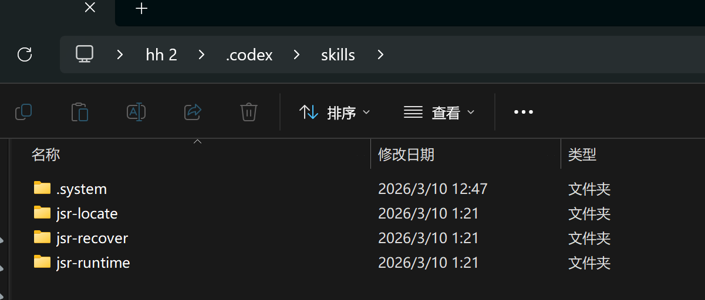

# reverse-skill

面向 Web JS 逆向分析的技能仓库，覆盖请求链定位、运行时诊断、AST 混淆恢复、JSVMP、worker、WASM、webpack/runtime 与协议语义分析。

## 安装

1. 接入 [js-reverse-mcp](https://github.com/zhizhuodemao/js-reverse-mcp)
2. 将以下目录复制到技能根目录：

- `jsr-locate`
- `jsr-runtime`
- `jsr-recover`

安装位置：

| 环境 | 路径 |
| --- | --- |
| `Codex` | `%USERPROFILE%\.codex\skills\` |
| `Claude Code` | `%USERPROFILE%\.claude\skills\` |




## 使用

推荐最小输入：

- `URL`
- `接口 / 字段 / 消息对象`
- `触发方式`
- `当前现象`
- `已知约束`：例如 `cookie`、是否允许补环境、是否要求纯算法

全自动调用示例：

```text
使用：js-reverse-mcp
方式：在真实浏览器插桩采集输入输出及中间态数据，与本地算法进行逻辑一致性和结果正确性对比分析。
URL: 【https://example.com】
目标：【接口 / 需要的数据】
触发方式: 【刷新页面】
cookie：【使用现有cookie / 优先不使用，必须则模拟完整链路生成游客态】
约束：不使用playwright等自动化工具、不联网搜索公开案例
必须纯算法实现，【能/不能】依赖补环境
交付：Node.js 生成加密参数，Python 负责调度和发送请求，运行后打印响应数据
```

定向调用示例：

```text
$jsr-locate 梳理请求 A 的写入边界、参数来源、上游依赖和 HttpOnly cookie 链路。
$jsr-runtime 判断当前问题属于缺状态、缺对象、反调试还是风控分支，并给出最小环境清单。
$jsr-recover 恢复当前 jsvmp + worker + wasm 组合壳，输出桥接边界、关键算子和等价性检查点。
```

按问题类型选择对应 skill：

| Skill | 适合处理 | 主要产物 |
| --- | --- | --- |
| `jsr-locate` | 动态字段、请求头、`cookie`、消息对象的写边界、来源链、依赖链 | `请求链路.md`、`总览.md` |
| `jsr-runtime` | 浏览器正常、本地异常；反调试、状态缺口、时序随机源、指纹面、风控分支 | `运行态清单.md`、`验证记录.md` |
| `jsr-recover` | `JSVMP`、`AST`、`worker`、`WASM`、`webpack/runtime`、协议壳遮蔽 | `恢复记录.md`、`验证记录.md` |

常见切换路径：

- `Locate -> Runtime`：写点已知，但浏览器与本地执行分叉
- `Locate -> Recover`：写点接近，但中间逻辑被遮蔽层包裹
- `Runtime -> Recover`：已排除简单缺对象 / 缺状态，需要进入壳层恢复
- `Recover -> Locate / Runtime`：恢复桥接边界或状态载体后，回到链路证明或运行时验证

## 技能概览

### `jsr-locate`

- 证明目标字段、请求头、`cookie`、消息字段的真实写边界
- 建立 `entry -> builder -> writer` 关系，展开前置请求、响应依赖和状态链
- 处理 `HttpOnly cookie`、`WebSocket`、`protobuf`、长连接场景的消息与连接状态

典型进入条件：

- 不清楚 `sign`、`token`、`cookie`、请求头、请求体字段从何处写入
- 已知目标请求，但不清楚其依赖的前置请求、响应字段或状态
- 需要将链路展开到可获得正常响应的闭合状态

### `jsr-runtime`

- 区分对象缺失、状态缺失、反调试、时间随机源、指纹面和风控分支
- 设计最小运行时清单，说明每项依赖的必要性和可移除性
- 建立执行模式、纯算迁移前检查和运行时验证联动

典型进入条件：

- 浏览器内正常，本地执行异常
- 调试后值变化、执行卡死、链路跳入风控分支
- 不清楚问题属于环境对象、会话状态、指纹消费还是风险校验

### `jsr-recover`

- 判定遮蔽层类型与最低必要恢复级别
- 恢复 `JSVMP`、`AST`、控制流平坦化、`worker`、`WASM`、`webpack/runtime`、协议壳
- 提取桥接契约、状态载体、关键算子和等价性检查点

典型进入条件：

- 已定位写回边界，但中间语义被多层壳遮蔽
- 需要先恢复桥接层、调度层或状态载体，才能继续定位或复现
- 需要判断当前任务应停留在 `A / B / C` 哪一级恢复深度

## 工作目录记录

执行三类 skill 时，默认在当前任务工作目录维护中文记录：

```text
<当前任务工作目录>/reverse-records/
└─ 会话N/
   ├─ 总览.md
   ├─ 请求链路.md
   ├─ 运行态清单.md
   ├─ 恢复记录.md
   └─ 验证记录.md
```

核心记录文件：

| 文件 | 用途 |
| --- | --- |
| `总览.md` | 当前阶段、已确认内容、卡点、下一步、风险 |
| `请求链路.md` | 请求区块、字段状态、来源 / 去向、上游展开、连接状态 |
| `运行态清单.md` | 最小运行时依赖、执行模式、纯算迁移前检查、可移除项 |
| `恢复记录.md` | 遮蔽层、恢复级别、桥接契约、状态载体、关键函数卡片 |
| `验证记录.md` | 固定输入、检查点、对照结果、差异定位、验证结论 |

记录规则：

- 一个逆向会话只使用一个 `会话N/` 目录
- 用户指定 `会话N` 时，只读取和写入该目录
- 用户未指定时，创建下一个未占用的 `会话N`
- 不覆盖、合并、重命名、清理其他 `会话N/` 目录中的记录
- 每次推进后至少更新一次当前会话 `总览.md`
- 涉及接口复现、状态链、连接状态链时优先更新当前会话 `请求链路.md`

## 适用与边界

适用：

- Web 端动态参数、登录链路、挑战链路、指纹链路、风控链路分析
- 请求重放前的来源证明、状态证明、依赖闭合和运行时闭合
- `jsvmp`、AST、`worker`、`wasm`、`webpack/runtime`、协议封装等典型遮蔽层恢复
